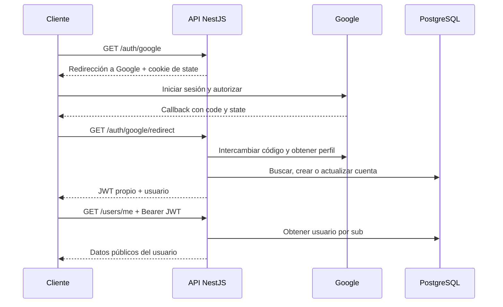

# Identidad Campus API

Backend de un trabajo práctico universitario que permite iniciar sesión con Google, crear o vincular una cuenta en PostgreSQL y acceder a rutas privadas mediante un JWT propio.

**Tecnologías:** NestJS 11, TypeScript, Passport, passport-google-oauth20, @nestjs/passport, @nestjs/jwt, @nestjs/config, Prisma ORM 6.19 y PostgreSQL.

## Qué implementa

- Inicio de sesión federado mediante Google OAuth 2.0 y protección del callback con `state`.
- Creación o reutilización de usuarios por email normalizado, con restricciones únicas en PostgreSQL.
- JWT con identidad mínima, firma HS256, vencimiento, emisor y audiencia.
- Ruta privada `/users/me` protegida por `JwtAuthGuard` y una estrategia JWT separada.
- Configuración validada al iniciar, sin credenciales reales en el repositorio.
- Modelo híbrido con Google ID y hash de contraseña opcionales para cuentas federadas o locales.
- Guía de pruebas manuales y documentación para explicar el proyecto oralmente.

## Arquitectura

La arquitectura separa autenticación (`AuthModule`), cuentas (`UsersModule`) y persistencia (`PrismaModule`). `UsersService` concentra la búsqueda, creación y vinculación por email; `AuthService` emite tokens. No hay consultas Prisma en controllers.

```text
src/
├── auth/       # Controllers, emisión de JWT, estrategias, guards y estado OAuth
├── users/      # Búsqueda, creación, actualización y presentación de cuentas
├── prisma/     # Cliente Prisma compartido y ciclo de conexión
├── config/     # Validación de variables de entorno
├── app.module.ts
└── main.ts
prisma/
├── schema.prisma
└── migrations/
```

El árbol completo y el propósito de cada componente se encuentran en [DOCUMENTACION.md](DOCUMENTACION.md#arquitectura-y-responsabilidades).



## Puesta en marcha

Requisitos: Node.js 20.19+ (verificado con 22.16), npm, PostgreSQL 16 o Docker Desktop y credenciales OAuth de Google de tipo aplicación web. Descargar o clonar este repositorio y abrir una terminal en su carpeta.

### 1. Instalar dependencias

```bash
npm ci
```

`npm ci` utiliza el lockfile entregado y genera Prisma Client automáticamente. No se necesita crear nuevamente el proyecto Nest ni ejecutar `prisma init`.

### 2. Configurar el entorno y Google

Copiar `.env.example` a `.env` y generar un secreto:

```powershell
Copy-Item .env.example .env
node -e "console.log(require('node:crypto').randomBytes(48).toString('hex'))"
```

El segundo comando genera un valor nuevo para `JWT_SECRET`. No guardar ese valor en el repositorio. En macOS/Linux se puede copiar con `cp .env.example .env`.

| Variable | Valor que debe configurarse |
| --- | --- |
| `GOOGLE_CLIENT_ID` | Client ID de Google Cloud |
| `GOOGLE_CLIENT_SECRET` | Client Secret de Google Cloud |
| `GOOGLE_CALLBACK_URL` | `http://localhost:3000/auth/google/redirect` en desarrollo |
| `JWT_SECRET` | Secreto aleatorio de al menos 32 caracteres |
| `DATABASE_URL` | URL de conexión a la base PostgreSQL |
| `JWT_EXPIRES_IN` | Duración del JWT; ejemplo: `15m` |
| `PORT` | Puerto de la API; por defecto `3000` |
| `NODE_ENV` | `development` para ejecutar localmente |

En Google Cloud, configurar la aplicación OAuth, habilitar la cuenta de prueba cuando corresponda y crear un cliente de tipo **aplicación web**. Registrar exactamente este URI de redirección:

```text
http://localhost:3000/auth/google/redirect
```

Completar Client ID y Client Secret en `.env`. La [guía desde cero](DOCUMENTACION.md#configuración-desde-cero) explica cada paso.

### 3. Iniciar PostgreSQL, migrar y ejecutar

Para PostgreSQL con Docker:

```bash
docker compose up -d postgres
npx prisma migrate dev
npm run start:dev
```

El compose usa credenciales de desarrollo que coinciden con `.env.example`. Si ya existe PostgreSQL local, crear una base propia y adaptar `DATABASE_URL`; Docker es opcional. El callback registrado en Google debe ser exactamente `http://localhost:3000/auth/google/redirect`.

La API escucha en `http://localhost:3000`. El backend no incluye una página de inicio en `/`: ingresar directamente a `/auth/google`.

En PowerShell con scripts deshabilitados, usar `npm.cmd` y `npx.cmd` en lugar de `npm` y `npx`. No hace falta cambiar la política de ejecución.

## Endpoints

| Método y ruta | Acceso | Resultado |
| --- | --- | --- |
| `GET /auth/google` | Público | Redirección a Google y cookie temporal de estado |
| `GET /auth/google/redirect` | Callback OAuth | JSON con `accessToken` y `user` |
| `GET /users/me` | `Authorization: Bearer TOKEN` | Datos públicos del usuario autenticado |

Abrir `http://localhost:3000/auth/google` en un navegador. Luego copiar el JWT devuelto y consultar:

```bash
curl -i http://localhost:3000/users/me -H "Authorization: Bearer TOKEN"
```

En Windows puede usarse `curl.exe` para evitar el alias de PowerShell.

El callback devuelve una respuesta como esta, con datos ficticios en el ejemplo:

```json
{
  "accessToken": "JWT_PROPIO_DE_LA_API",
  "user": {
    "id": "83784a0f-6f13-466d-aab6-e0062a192b19",
    "email": "alumno@gmail.com",
    "displayName": "Alumno",
    "profilePicture": null,
    "authProvider": "GOOGLE"
  }
}
```

Sin token, con firma inválida, con token vencido o con una cuenta eliminada, `/users/me` responde `401 Unauthorized`. Con un token válido y una cuenta existente responde `200 OK`.

OAuth se utiliza para el ingreso inicial. El JWT propio se utiliza para las solicitudes posteriores; no se envían tokens de Google a las rutas privadas.

## Verificación y entrega

```bash
npm run build
```

La entrega incluye instrucciones para probar el ingreso desde un navegador y consultar `/users/me` mediante Postman, Insomnia o curl. La compilación y las migraciones se verifican por separado. El login con Google real requiere completar las credenciales de quien ejecute el proyecto; no se realizó con una cuenta real durante estas verificaciones.

Para ejecutar el código compilado:

```bash
npm run build
npm start
```

- [DOCUMENTACION.md](DOCUMENTACION.md): explicación académica, instalación desde cero, flujo, árbol y pruebas manuales.
- [DECISIONES_TECNICAS.md](DECISIONES_TECNICAS.md): cinco decisiones y mejoras futuras.
- [CODIGO_COMPLETO.md](CODIGO_COMPLETO.md): listado del código de cada archivo con su ruta.
- [VERIFICACION.md](VERIFICACION.md): comprobaciones realizadas y alcance.

Prisma CLI y Client están fijados en 6.19.0; `package-lock.json` fija la resolución completa. Después de descargar el proyecto, `npm ci` permite reproducir las versiones instaladas. No actualizar Prisma a otra versión mayor sin adaptar su configuración.

## Credenciales y alcance

El repositorio entrega `.env.example` para que cada persona configure su entorno. `.env`, `node_modules/`, `dist/`, `.tmp/` y los ZIP de entrega están excluidos por `.gitignore`.

El modelo admite cuentas LOCAL con `passwordHash` y cuentas GOOGLE sin contraseña. El flujo implementado en esta entrega es el ingreso con Google; los endpoints para registro y login con contraseña quedan como ampliación. El hash no se devuelve al cliente ni se incluye en el JWT.

El trabajo sigue los cuatro criterios de la guía académica: configuración OAuth, arquitectura con Passport, persistencia híbrida sin cuentas duplicadas y firma JWT. La [documentación](DOCUMENTACION.md#relación-con-la-guía-del-trabajo-práctico) detalla cómo se cubre cada punto.

Refresh tokens, revocación de tokens y roles se describen como mejoras futuras en [DECISIONES_TECNICAS.md](DECISIONES_TECNICAS.md#mejoras-futuras).
